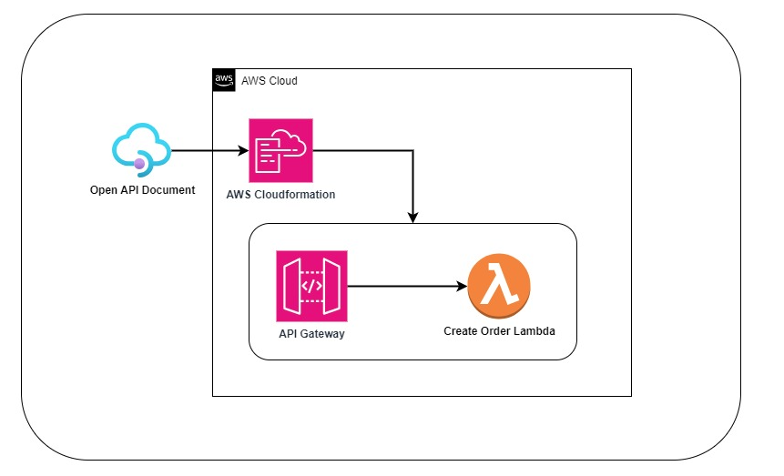

# restful-api-gateway-open-api-spec
Create Restful API Gateway, protected with API key authentication, based on OpenAPI Specification

This repository demonstrates how to create Restful API Gateway by using Open API documentation and how to protect our API gateway by API key authentication.
CORS options method is added in open api documentation. Also, CORS headers are added to response header in lambda function.
All resources are defined as code via AWS CDK library via using Java.

